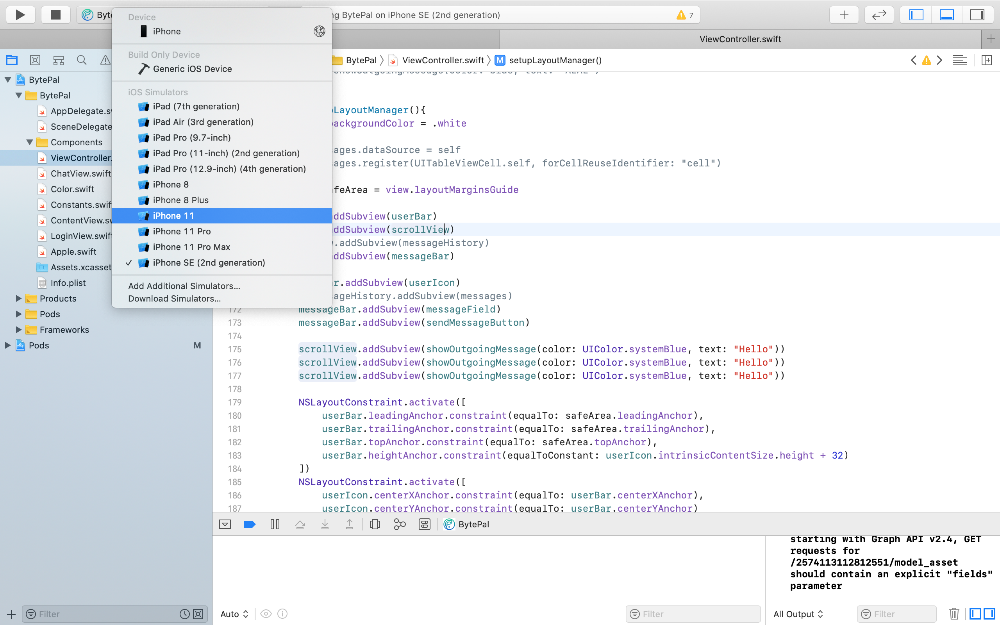

# BytePal iOS Mobile App Documentation

## Table of Contents
- [General Information](#General\ Information)
- [Setup](#Setup)

## General Information
### iOS Deployement 
- iOS Version: 13.4
### Features
These application features need to be reported to apple and included in the Terms of Service.
- In-app Purchase 
- Push Notifications

## Setup
Open the terminal application


Clone repository
```
git clone https://github.com/paulngouchet/BytePal.ai.git
```

Navigate to root directory of mobile application
```
cd ./BytePal.ai/App/BytePal
```

Install Cocoa Libraries
```
pod install
```

Open Project. **The project file opened MUST be the xcworkspace file.** The xcodeproj file does not include the Cocoapods libraries.
```
open BytePal.xcworkspace
```

In XCode in the left hand bar click on the folder icon and then click the drop downs BytePal > BytePal


In the navigation bar at the top click File > Add Files to "BytePal"...


Select all Swift files that are not greyed out and click the add button. Repeat this process if needed to add all swift files.


Select Device (optional). In the top bar to the right of the play button click on the iphone button and select the iPhone model you want.



In the top left click the play button. The simmulator will take some time to load and then it will go to a black screen while the app is loading. Now the app is loaded!

<center class="BytePal-Login-Screen">
    
</center>

